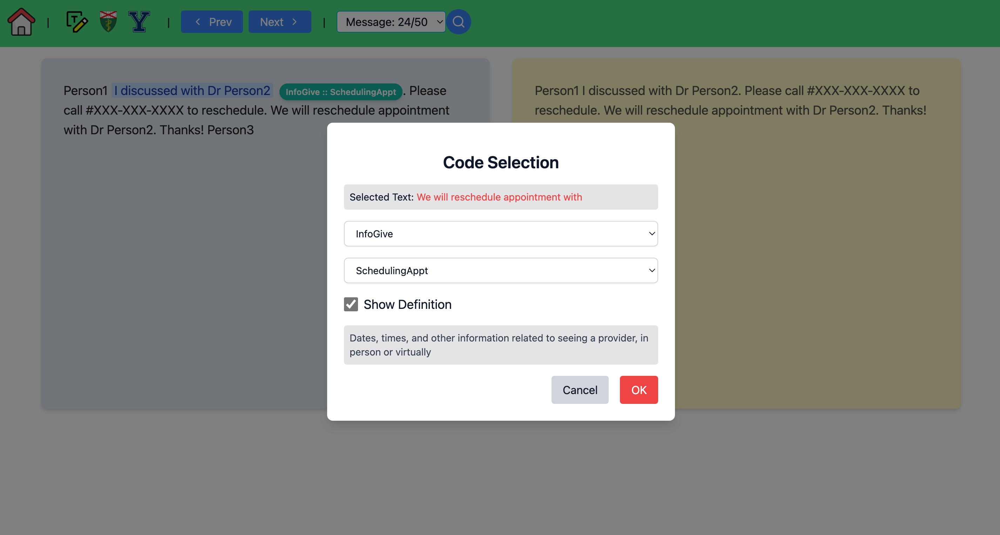

# Text Annotation Tool

A robust tool for creating annotated datasets from patient-provider conversations. This project is designed to assist researchers, data scientists, and NLP engineers in preparing high-quality data for training large language models (LLMs) in the healthcare domain.




## Features

- 🏷️ **Text Span Annotation**: Annotate conversations into heirarchical custom-defined categories such as clinical instruction, patient concern, medication inquiry, and more.
- 🤖 **PHI Redaction with Presidio**: Automatically de-identify personally identifiable information (PII/PHI) using transformer-based NER models.
- 📊 **Customizable Labels**: Define and manage custom annotation schemas for specific research use cases.
- 🧠 **Export Data**: Outputs datasets in JSON format which includes text, labels and span start and end offset, for fine-tuning or prompting LLMs.


## To run
```bash
chmod +x run.sh
./run.sh
```

## Usage

1. Open the tool in your browser (at `http://localhost:5713`).
2. Upload the text to annotate, optionally(redact PII)
3. Select text spans and assign labels.
4. Export your annotations when finished.


